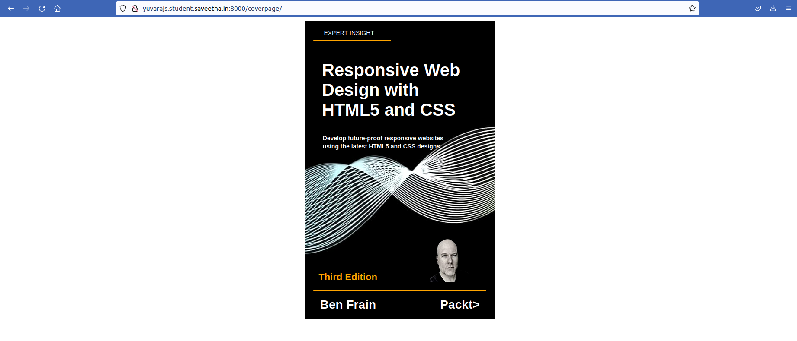

# cover-page-design
## AIM:
To develop a website to display the cover page design of a book

## Design Steps:

### Step 1:
First we want to fork and clone the github repository.
### Step 2:
Then we want to create a project and app in that project.
### Step 3:
In that we want change that urls.py and settings.
### Step 4:
Then we want to create a template folder following with app folder and html file.
### Step 5:
Then we want to create a static following with image folder and in that image file.
### Step 6:
Then we want to write revalent code in html file.
### Step 7:
Then we are ready to run the server and see our output.
## Code:
```
<!DOCTYPE html>
<html lang="en">
    <head>
        <title>Book Coverpage</title>
        <style>
        h1{
           color:white;
        }
         .bookpage{
             width: 400px;
             height: 650px;
             
             margin-left: auto;
             margin-right: auto ;
             padding: 20px;
             background-image: url('/static/images/dna.png');
             background-position: center;
             background-color: black;
             background-size: cover;
             background-repeat: no-repeat;
         }
         .toptext{
             color:white;
             padding-left: 5px;
             font-size: 14px;
             font-family: Arial, Helvetica, sans-serif;
             
         }
         .tophr{
             color: orange;
              width: 180px;
         }
         hr{
             color: orange;
            
         }
         .booktitle{
             font-family: Arial, Helvetica, sans-serif;
             padding: 10px 10px 0px 10px;
             display: flex;
             align-items: center;
             justify-content: center;
             margin-right: 10px;
             margin-left: 10px;
             font-size: 20px;
             line-height:normal;
         }
         .author{
             color:white;
             display:inline;
             position:relative;
             font-family: Arial, Helvetica, sans-serif;
             display: inline;
             font-size: 24px;
             line-height: 5px;
              
             
         }
         .sub-text {
             color:white;
             font-family: Arial, Helvetica, sans-serif;
             display: flex;
             line-height: 5px;

            
            
  margin-right: 10px;
  margin-left: 10px;

  font-size: 14px;
  }
  
.footer {
    color:orange;
    padding-top:180px;
}
.image {
    color:white;
             font-family: Arial, Helvetica, sans-serif;
    font-size: 22px;
    margin-right: px;
}
.bottomhr { 
    color: red;
              width: 400px;

}
img {
    width: 90px;
    height: 100px;
    margin-right: 20px;
    vertical-align:bottom;
}
.edition {
    color:orange;
             font-family: Arial, Helvetica, sans-serif;
    font-size: 22px;
    line-height: bottom;
 
}


        </style>
        </head>
            <body>
                <div class="bookpage">
                    <div class="toptext">&nbsp;&nbsp;&nbsp;&nbsp;&nbsp;EXPERT INSIGHT</div>
                    <div class="tophr"><hr></div> 
               <div class="booktitle"><h1> Responsive Web Design with HTML5 and CSS </h1></div>
               <h3 class="sub-text">&nbsp;&nbsp;&nbsp;Develop future-proof responsive websites</h3>
                    <h3 class="sub-text">&nbsp;&nbsp;&nbsp;using the latest HTML5 and CSS designs</h3>
                    <div class="footer">
                        <h2 class="edition">&nbsp;&nbsp;Third Edition&nbsp;&nbsp;&nbsp;&nbsp;&nbsp;&nbsp;&nbsp;&nbsp;&nbsp;&nbsp;&nbsp;&nbsp;&nbsp;&nbsp;&nbsp;&nbsp;&nbsp;&nbsp;&nbsp;  </h2>
                      
                        <div class="bottomhr"><hr></div>
                    <div class="author"><h3>&nbsp;&nbsp;Ben Frain &nbsp;&nbsp;&nbsp;&nbsp;&nbsp;&nbsp;&nbsp;&nbsp;&nbsp;&nbsp;&nbsp;&nbsp;&nbsp;&nbsp;&nbsp;&nbsp;&nbsp;&nbsp;Packt></h3></div>
                    
                </div>
                </div> 
                
            </body>
        
    
</html>
```
## Output:


## Result:
The output for Book cover page is succussfully displayed.
